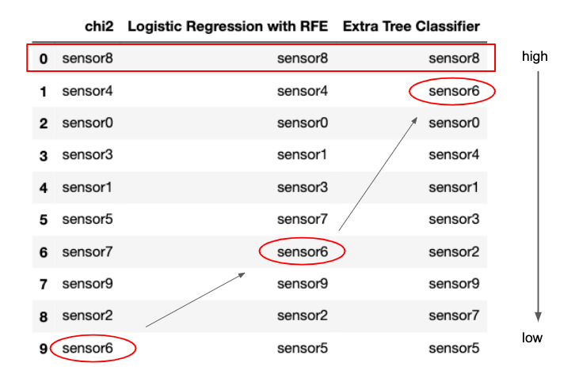

# Feature Ranking

This repo contains the task of feature ranking of the dataset. There are 10 features and one target variable.


### Note:
I have created a custom pipeline to automate the process of pre-processing, fitting the model and generating the results. This code can be easily extended to include the checks to handle a complex dataset. Currently this code caters only the dataset provided.


### Results and Insights:



1. Sensor 8 has the highest importance in all the three methods.
2. Correlation of one sensor with the target variable does not imply that the same variable will have an important impact in the prediction power of the model. See Sensor 6 and 5 for example.
3. Sensors 8,4,0,1,3 continue to hold the importance in the top 5 ranks in all the three methods.

(Detailed analysis with the reasons of such behaviour, advantages, disadvantages and scalability is described in jupyter notebook and pdf file.)


### Conclusion of the Analysis:
I would not rely solely on chi2 method for feature ranking because it does not account for inter-feature dependancy. I would rather use it as a pre-processing step. I would prefer Logistic Regression with Recursive Feature Elimination for this dataset since the number of feature variables are small and there are no complexities of such as class imbalance or irregular scale associated with the data. For scalability purpose, I would prefer tree based method or L1/L2 regilarization.
There is no one solution. We always have to try out different methods and analyze them before reaching to any conclusion.


### Getting Started:
#### Installing Python dependencies
1. Clone or download the project as it is.
2. Create a data folder and put task_data.csv file in it. Note that I haven't put the exact dataset in this repo.
3. Go to the cloned repo via Terminal/CommandPrompt. Execute below commands to create and activate virtual environment.
```
$ python3 -m venv virtual-env-name
$ source virtual-env-name/bin/activate
$ pip install -r requirements.txt
$ python main.py
```
or with anaconda
```
conda create -y -n <conda-env-name> python==3.6
conda install -f -y -q -n <conda-env-name> -c conda-forge --file requirements.txt
[source activate/ conda activate] <conda-env-name>
python main.py
```
Alternatively, simple run the provided bash script. It will create environment called ranking for you.
```
$ ./pipeline.sh
```

Results will appear in ./output/results.csv


### Author
* **Rupali Sinha** - *Initial work*
